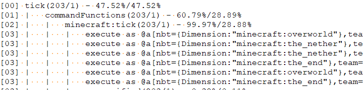
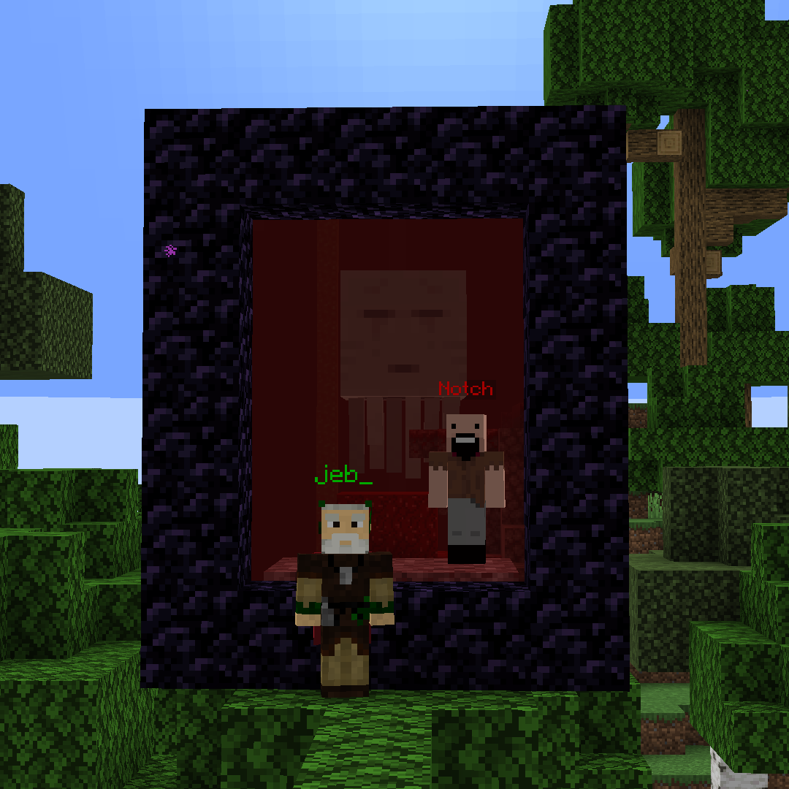

## Dimensional Tracker

Fabric mod that color nicknames based on their dimension.  
Compatible with VT AFK Display, [Sessility](https://modrinth.com/mod/sessility) Mod and [Text Placeholder API](https://modrinth.com/mod/placeholder-api)

This mod utilizes vanilla scoreboard teams to color nicknames and provide optional placeholders.

#### [CurseForge](https://legacy.curseforge.com/minecraft/mc-mods/dimensional-tracker), [Modrinth](https://modrinth.com/mod/dimensionaltracker), [My Discord](https://discord.gg/UY4nhvUzaK)

## Customization  
With default settings:  
Green = Overworld  
Red = The Nether  
Purple = The End  

Config file is located in `config/DimensionalTracker.properties`.

#### Team configuration
If you don't want to be detected, simply join a different team.  
You can modify your team's color, add a prefix or suffix using the standard Minecraft [`/team` command](https://minecraft.wiki/w/Commands/team).  
To add support for non-vanilla dimensions, create a team named `dimTracker.<dimension_name>`.

#### Placeholder Configuration
Dimensional Tracker provides three placeholders:
   - %dimensional-tracker:dimension_color%: The color of the dimension the player is in
   - %dimensional-tracker:dimension_name%: The name of the dimension the player is in
   - %dimensional-tracker:dimension_id%: The id of the dimension the player is in
You can configure the placeholders in the config file.

## Why this mod instead of datapacks?  
Because of how datapacks work they should check dimensions every tick. It's okay for singleplayer, but on servers it can cause lag.  
In testing, I saw that it can take up to 30% of MSPT for 10 players:

## Example of how it works using Immersive Portals

